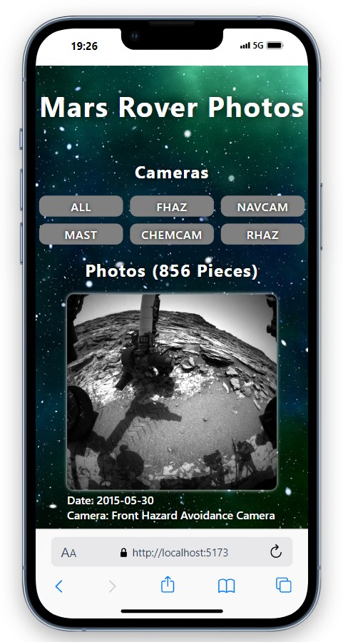
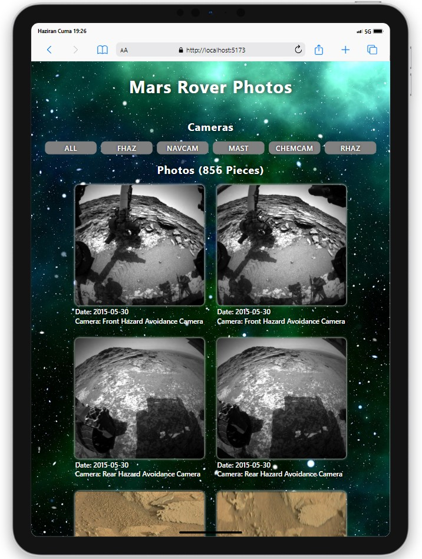
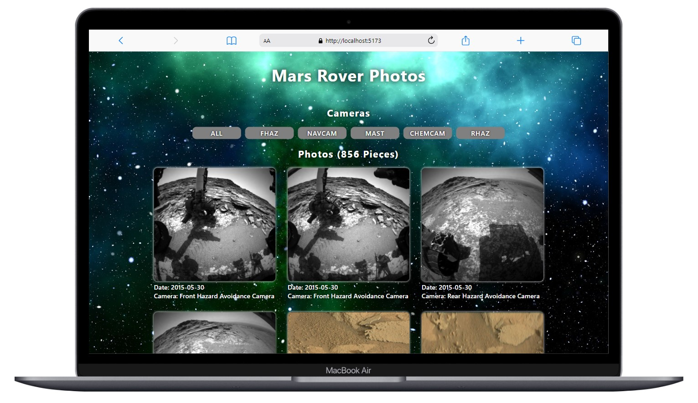

# Mars Rover Photos

<div align="center">
  
</div>

## About the Project

This project is a frontend application designed to display photos captured by NASA's Mars exploration rovers. Fetches and displays photos taken by the Curiosity rover on Mars via the NASA Mars Photos API. Users can switch between different cameras and view relevant photos.

## Table of Contents

- [Usage](#usage)
- [Technologies Used](#technologies-used)
- [Project Skeleton](#project-skeleton)
- [Screenshots](#screenshots)

## Live Demo

[Mars Rover Photos](https://mars-rover-pure-js.vercel.app/)

## Usage

- Photos of the Mars rover Curiosity on day 1000 are automatically uploaded.
- Users can switch between different cameras using the buttons at the top.
- Filtered photos based on the selected camera are displayed in card format below.
- Each photo card includes the image itself, the date it was taken (earth_date), and the camera information.

## Technologies Used

- Vite
- HTML
- CSS
- JavaScript (ES6+)
- NASA Mars Photos API

## Project Skeleton

```
Mars Rover Photos (folder)
│ 
├── assets
│     └── [images]       
├── public
├── .gitignore
├── index.html
├── main.js
├── package-lock.json
├── package.json
├── README.md
└── style.css
```

## Screenshots

<div align="center">
  
  
  
</div>

## Compatibility

The project is compatible with both wide-screen computers and mobile devices.

## Acknowledgments

Products data provided by [Nasa API](https://api.nasa.gov/)